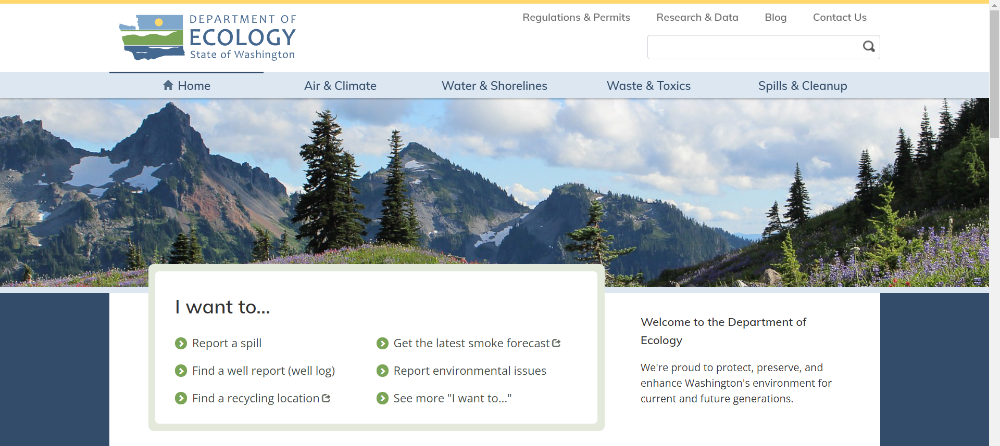

# Evaluating the Washington State Departments of Ecology and Tourism
**State of Interest:** Washington State  
**Author:** Evelyn Hu  
**Course:** DH110 User Interface and Design  
**Description:** A heuristic evaluation of the websites of the Washington State Department of Ecology and Department of Tourism using Nielson's 10 Usability Heuristics.

## Assignment 01: Heuristic Evaluation of Washington
The purpose of this assignment is to evaluate various government webpages to ensure that they are designed in a way that allows for a good user experience. As government websites are accessed by all kinds of people, it is crucial that good design choices were made so that they are accessible to everyone who views it. As someone who grew up in Seattle, Washington, one of the things I miss the most about Washington is its beautiful nature. The Pacific Northwest is famous for its breathtaking sceneries and hiking spots, and for good reason - the sights are truly one to behold. By inspecting the Departments of Ecology and Tourism, I would like to encourage more people to attain more information about these respective departments and one day experience the sights for themselves, through the act of improving upon the websites.  

## Severity Ratings of Usability Problems by [Nielsen Norman Group](https://www.nngroup.com/articles/how-to-rate-the-severity-of-usability-problems/)
The following scale will be used to evaluate the various heuristics present on each website to determine whether or not an improvement is necessary.  
**1** = Cosmetic problem only: need not be fixed unless extra time is available on project  
**2** = Minor usability problem: fixing this should be given low priority  
**3** = Major usability problem: important to fix, so should be given high priority

## Website 1: Washington State Department of Ecology
**Website Information:**  
  
A website dedicated to the Department of Ecology, which aims to protect, preserve, and enhance Washington's environment.
  
**Heuristic Evaluation:**  

| **Heuristic and Description** | **Website Evaluation** | **Recommendation** |
| --- | --- | --- |
| 1. Visibility of System Status: The website allows the user to know what is going on, and gives users appropriate feedback to their inputs | **Bad**: When navigating to a page under a category on the menu bar, there is only a subtle line above the current category that could be easily missed.    **Good**: The menu bar floats as the user scrolls, making it easy for users to navigate and see which page they are on. **2** | Adjust menu bar to completely highlight the current page the user is on. |
| 2. Match Between System and the Real World: The website uses a design, images, and language that is easily understood by users | **Good**: The website utilizes language that is easily understood by everyone fluent in English. Most acronyms are defined.  **Bad**: There are free language services provided for Chinese, Korean, Spanish, and Vietnamese speakers; however, the user must request these services by calling or emailing a representative. Some instances where acronyms are not completely defined and may be confusing. **2** | Language translations for all pages should be readily available on the website, instead of having users go through an interpreter, who is only available during normal business hours. Ensure that all acronyms are clearly defined. |
| 3. User Control and Freedom: The user is able to undo and redo tasks | **Bad**: All pages do not have a "Back" button and therefore do not allow users to navigate ("undo" the opening of a page) as smoothly as their experience should be. **Bad**: There are not many tasks the user *can* do on this website; there is mostly only information to be garnered from the site. For example, only emails of staff are provided; there is no contact box to easily contact without navigating away from the website. **3** | Provide on-site contact boxes so that users can easily communicate with staff when necessary. Implement "back" buttons onto the website for easy navigation. |
| 4. Consistency and Standards: Layout design is consistent among all pages of the website | **Good**: All pages on the website are consistent in layout design. | No recommendations for improvement. |
| 5. Error Prevention: The website prevents common user errors by providing safety nets | **Good**: No broken links were found on the website.  | No recommendations for improvement; there is not much room for error on the website to begin with due to its limited functionality (i.e. mostly provides information over functionality). |
| 6. Recognition Rather Than Recall: The website offers help and suggestions to make the user experience more effortless | **Bad**: When using the search bar on the website, no suggestions are given when the user is typing. **Bad**: When querying a search term, even news articles, blog posts, and less relevant pages are searched, making it difficult for users to find exactly what they are looking for. **Bad**: If the user enters a search term and the engine cannot find any results, no suggestions for another search term to try are given. **3** | Refine search bar and process by offering search term suggestions as the user is typing and if no results are returned. Allow users to choose which type of page they want to search, e.g. a webpage, news article, blog post, etc. |
| 7. Flexibility and Efficiency of Use: The website is accessible to all possible types of users, from experienced to novice | **Good**: The site is easy to navigate, and major categories are clearly communicated on the main navigation bar. **Bad**: When using the search bar, the magnifying glass that should be clicked for the search to initiate is within the search bar; this may be misleading to some users who may think it is not clickable. **2** | Move the magnifying glass out of the search bar to better communicate that it is a clickable button, or replace it with a "Search" button for ever clearer communication to users. |
| 8. Aesthetic and Minimalist Design: The website only provides necessary and relevant information and content | **Good**: All content on the website is relevant to the topic at hand. The layout uses a minimalist design where items are easy to find. | No recommendations for improvement. |
| 9. Help Users Recognize, Diagnose, and Recover From Errors: The website describes errors in detail and offers solutions to fix it | **Good**: If a user navigates to a 404 Error page, there are many resources and solutions offered to help the user find the page they were looking for. **Bad**: Though thorough, the suggestions given are all rather general and would be more useful if they gave suggestions specifically tailored to the cause of the error. **Bad**: There is no back button on the page, so a user cannot easily navigate back to where they came from if they happen to click on a bad link. **2** | Include a "back" button so that users can easily get back to the previous page they were on and try navigating again. Have the error page automatically try a search term to help users locate where exactly they were trying to go. |
| 10. Help and Documentation: The website provides users with help to successfully complete tasks | **Good**: There is an "I want to..." page that provides users with commonly requested information. **Bad**: The link to this page is on the very bottom of each page and is easily missed. **Bad**: While there are FAQ sections within specific subpages, they are slightly hard to find and hidden behind many links. There is no general FAQ page or list of FAQ pages, or it is not easily found. **2** | Move the "I want to..." page or a summary of its contents to a place where it is more easily seen. Provide easy navigation to FAQ pages so users can easily access them. |

## Website 2: Experience Wa
**Website Information:**  

The official travel and tourism website for the state of Washington
  
**Heuristic Evaluation:**  
| **Heuristic and Description** | **Website Evaluation** | **Recommendation** |
| --- | --- | --- |
| 1. Visibility of System Status: The website allows the user to know what is going on, and gives users appropriate feedback to their inputs | List all new or modified files | :) |
| 2. Match Between System and the Real World: The website uses a design, images, and language that is easily understood by users | Show file differences that haven't been staged | :D |
| 3. User Control and Freedom: The user is able to undo and redo tasks | Show file differences that haven't been staged | :D |
| 4. Consistency and Standards: Layout design is consistent among all pages of the website | Show file differences that haven't been staged | :D |
| 5. Error Prevention: The website prevents common user errors by providing safety nets | Show file differences that haven't been staged | :D |
| 6. Recognition Rather Than Recall: The website offers help and suggestions to make the user experience more effortless | Show file differences that haven't been staged | :D |
| 7. Flexibility and Efficiency of Use: The website is accessible to all possible types of users, from experienced to novice | Show file differences that haven't been staged | :D |
| 8. Aesthetic and Minimalist Design: The website only provides necessary and relevant information and content | Show file differences that haven't been staged | :D |
| 9. Help Users Recognize, Diagnose, and Recover From Errors: The website describes errors in detail and offers solutions to fix it | Show file differences that haven't been staged | :D |
| 10. Help and Documentation: The website provides users with help to successfully complete tasks | Show file differences that haven't been staged | :D |
