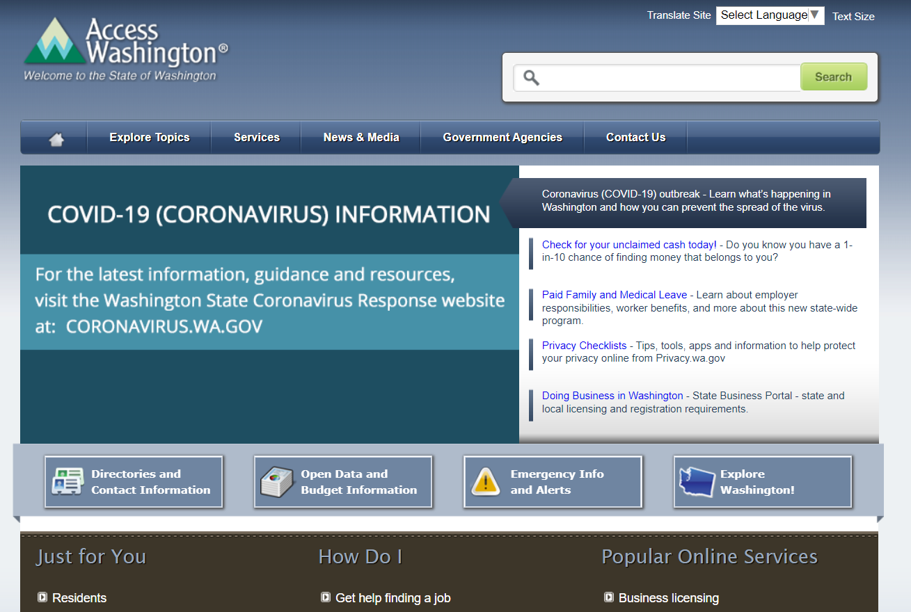

# (Title of Project)
State of Interest: Washington  
Author: Evelyn Hu  
Course: DH110 User Interface and Design  
Description: 

## Assignment 01: Heuristic Evaluation of Washington
Purpose of assignment:

https://access.wa.gov/

## Website 1:
**Website Information:**  
Insert text here.
  
**Heuristic Evaluation:**  

## Website 2:
**Website Information:**  
Insert text here.
  
**Heuristic Evaluation:**  
